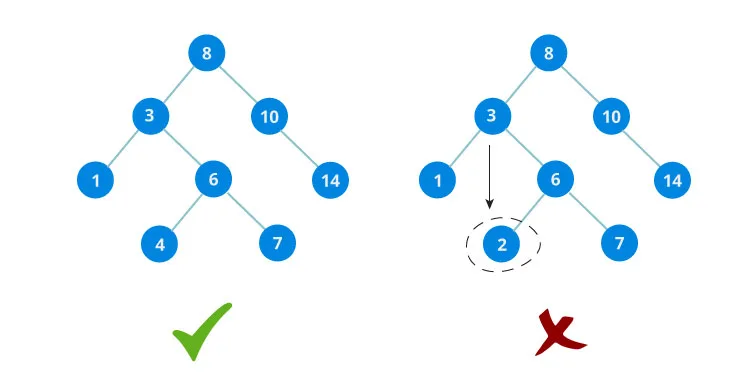

# Tổng quan

:::info Cây

Cấu trúc cây **Tree** là một tập hợp các phần tử gọi là nút **node**, mỗi cây có một nút gốc **root** chứa nhiều nút con, mỗi nút con lại là một tập hợp các nút khác gọi là cây con **subtree**.

:::

:::danger Cây nhị phân **Binary Tree**

Cây nhị phân là một trường hợp đặc biệt của cấu trúc cây và nó cũng phổ biến nhất. Đúng như tên gọi của nó, cây nhị phân có bậc là 2 và mỗi nút trong cây nhị phân đều có bậc không quá 2.

:::

## Một số loại cây nhị phân

### Cây nhị phân đầy đủ (full binary tree)

:::info

Cây nhị phân đầy đủ là cây nhị phân nếu và chỉ nếu:

-   Mỗi nút không phải lá có đúng 2 con
-   Tất cả các nút lá có mức bằng nhau

:::

:::success Cần nhớ

Với h là chiều cao của cây:

-   Một cây nhị phân đầy đủ sẽ có chiều cao là: $2^{h}$
-   Một cây nhị phân đầy đủ sẽ có số nút là: $2^{h+1}-1$

:::
