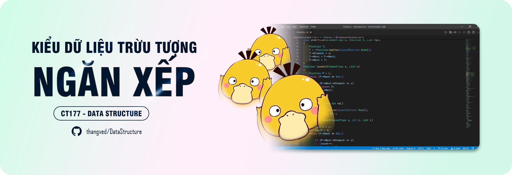

# TỔNG QUAN



## KHÁI NIỆM

:::info Khái niệm
Là một dạng `danh sách` đặc biệt mà việc thêm hay xóa một phần tử chỉ thực hiện tại một đầu hay đỉnh của danh sách.
:::

```c
typedef struct{
    ElementType Elements[MaxLength];
    int Top_idx;
} Stack;
```

### MaxLength

> Là số phần tử tối đa của `Stack`.

```c
#define MaxLength <number>
```

### ElementType

> Kiểu phần tử của ngăn xếp.

```c
typedef <type> ElementType;
```
