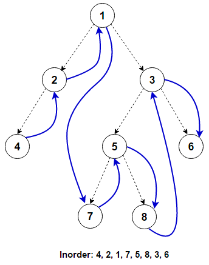
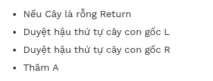

# Định nghĩa

## Nút

```c
struct Node
{
    int Data;
    struct Node *Left, *Right;
};
typedef struct Node* Tree;
```

## initTree

:::info

Hàm khởi tạo và trả về một cây rỗng

:::

```c
Tree initTree(){
    return NULL;
}
```

## isEmpty

:::info

hàm kiểm tra cây có gốc là T có rỗng hay không?

:::

```c
int isEmpty(Tree T)
{
    return T == NULL;
}
```

## createTree

:::info

Hàm tạo một cây nhị phân từ giá trị x và hai cây con có sẵn l, r

:::

```c
Tree createTree(int x, Tree l, Tree r)
{
    Tree T = (Tree)malloc(sizeof(struct Node));
    T->Data = x;
    T->Left = l;
    T->Right = r;
    return T;
}
```

## getHeight

:::info

Trả về chiều cao của cây

:::

```c
int getHeight(Tree T)
{
    if (T == NULL)
        return -1;
    int lh = getHeight(T->Left);
    int rh = getHeight(T->Right);

    return 1 + (lh > rh ? lh : rh);
}
```

## getLeaves

:::info

Hàm đếm số nút lá của một cây nhị phân T

:::

```c
int getLeaves(Tree T)
{
    if (T == NULL)
        return 0;
    if (T->Left == NULL && T->Left == NULL)
        return 1;
    return getLeaves(T->Left) + getLeaves(T->Right);
}
```

## Các hàm duyệt cây

### Duyệt tiền tự **preOder**

| Thứ tự duyệt                          | Minh Minh họa                         |
| ------------------------------------- | ------------------------------------- |
|  |  |

```c
void preOrder(Tree T)
{
    if (T == NULL)
        return;
    printf("%d ", T->Data);
    preOrder(T->Left);
    preOrder(T->Right);
}
```

### Duyệt trung tự **inOder**

| Thứ tự duyệt                         | Minh Minh họa                        |
| ------------------------------------ | ------------------------------------ |
|  |  |

```c
void inOrder(Tree T)
{
    if (T == NULL)
        return;
    inOrder(T->Left);
    printf("%d ", T->Data);
    inOrder(T->Right);
}
```

### Duyệt hậu tự **postOder**

| Thứ tự duyệt                          | Minh Minh họa                          |
| ------------------------------------- | -------------------------------------- |
|  |  |

```c
void postOrder(Tree T)
{
    if (T == NULL)
        return;
    postOrder(T->Left);
    postOrder(T->Right);
    printf("%d ", T->Data);
}
```
