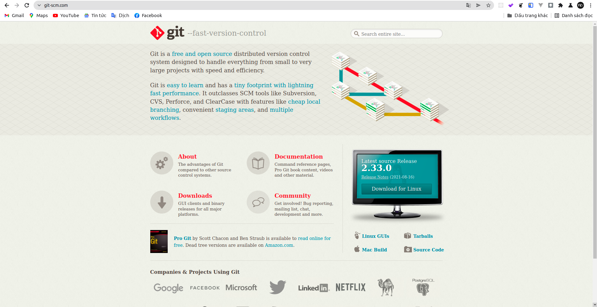

# Cài đặt git



## Windows

Các bạn truy cập vào trang web <https://git-scm.com/> nhấn vào download for Windows để tải git và cài đặt.

## Linux

Các bạn chỉ việc gõ câu lệnh sau trên `Terminal`:

```sh
sudo apt install git
```

## MacOS

Các bạn chỉ việc gõ câu lệnh sau trên `Terminal`:

```sh
brew install git
```
