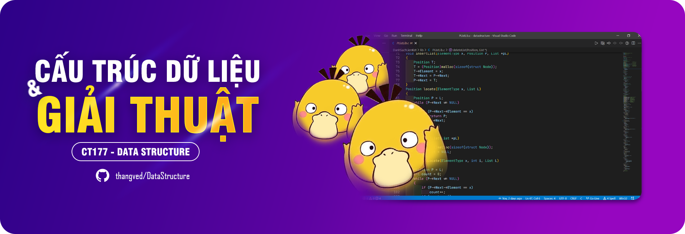
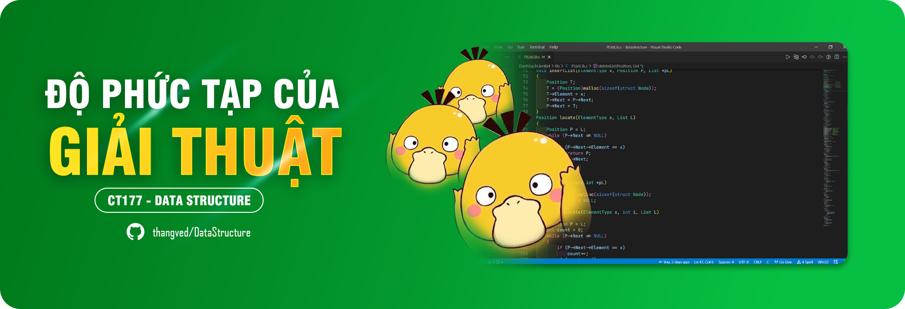

# TỔNG QUAN

> Tài liệu môn cấu trúc dữ liệu được thực hiện bởi một con **ZỊT**, bao gồm một số nội dung sau:

## ĐỘ PHỨC TẠP CỦA GIẢI THUẬT

> Hiểu được cách tính độ phức tạp của giải thuật cũng như cách để tối ưu thuật toán.

