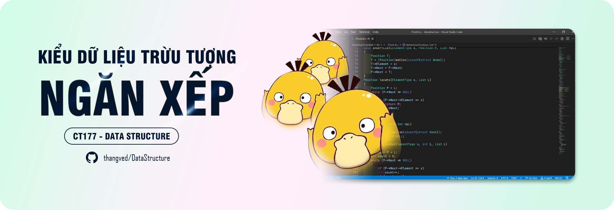

# Tổng quan

:::info
Tài liệu môn cấu trúc dữ liệu được thực hiện bởi một con **ZỊT**, bao gồm một số nội dung sau:
:::

## ĐỘ PHỨC TẠP CỦA GIẢI THUẬT

:::info
Hiểu được cách tính độ phức tạp của giải thuật cũng như cách để tối ưu thuật toán.
:::

## CÁC KIỂU DỮ LIỆU TRỪU TƯỢNG CƠ BẢN

:::info
Tìm hiểu về một số kiểu dữ liệu trừu tượng cơ bản và các phép toán liên quan.
:::

### Danh sách đặc

### Danh sách liên kết

### Ngăn xếp

### Hàng đợi

### Cây
